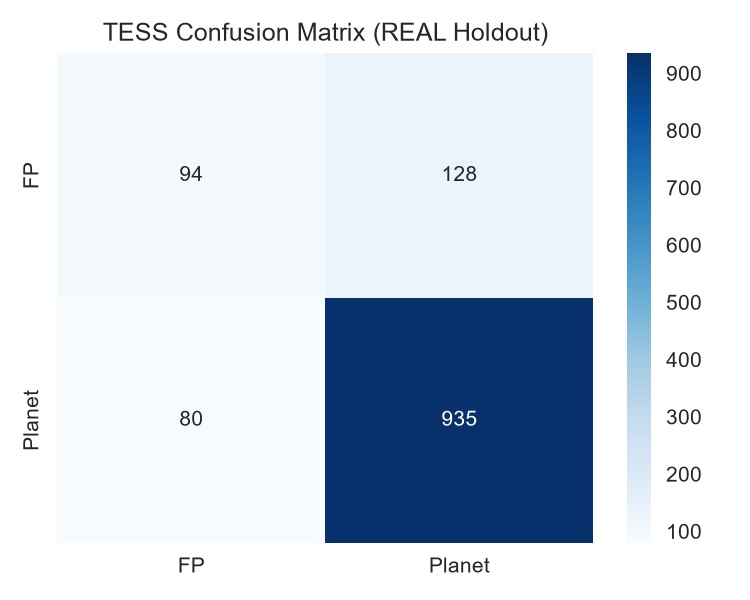

# 🪐 Exoplanet AI — Cross-Mission Planet Hunter

**NASA Space Apps Challenge 2025 — "A World Away: Hunting for Exoplanets with AI"**

An end-to-end machine learning pipeline that learns from NASA's Kepler mission (2009-2018) and generalizes to TESS (2018-present).

---

## 🚀 Key Results

| Experiment | Accuracy | What it proves |
|------------|----------|----------------|
| **Kepler-only (6 features)** | **84.7%** | Baseline works on original mission |
| **Zero-shot Kepler → TESS** | **52.6%** | Domain shift is real — telescopes differ |
| **Combined + Scaled** | **83.2%** | Transfer learning solves it (92% planet recall) |

> Trained on 9,564 Kepler KOIs, tested on 1,237 unseen TESS TOIs (holdout).

---

## 🧠 Method

1. **Data:** NASA Exoplanet Archive — Kepler KOI + TESS TOI tables
2. **Features (6 common):** `koi_period, koi_depth, koi_duration, koi_prad, koi_steff, koi_srad`
3. **Model:** RandomForestClassifier (300 trees) + StandardScaler
4. **Validation:** Stratified holdout — no data leakage

---

## 📊 Results

**TESS Holdout Confusion Matrix:**
- True Planets caught: **935 / 1,015 (92% recall)**
- False Positives correctly rejected: **94 / 222**

---

## 📁 Repository Structure